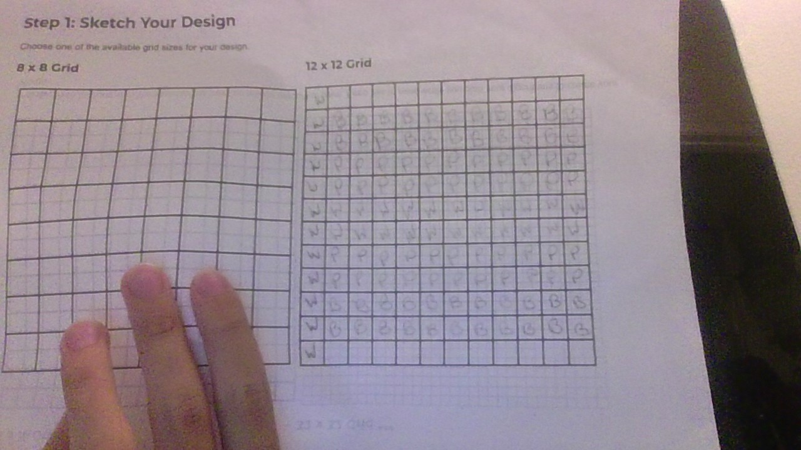

# Unit 1 - Asphalt Art

## Introduction

Cities use asphalt art to improve public safety, inspire their residents and visitors, and brighten communities. Your goal is to create asphalt art to revitalize The Neighborhood and bring the community together with the help of the Painter.

## Requirements

Use your knowledge of object-oriented programming, algorithms, the problem solving process, and decomposition strategies to create asphalt art:
- **Create a new subclass** – Create at least one new subclass of the PainterPlus class that is used for a component of the asphalt art design.
- **Plan an algorithm** – Use the problem solving process and decomposition strategies to plan an algorithm that incorporates a combination of sequencing, selection, and/or iteration.
- **Write a method** – Write at least one method in a PainterPlus subclass that contributes to a component of the asphalt art design.
- **Document your code** – Use comments to explain the purpose of the methods and code segments.

## Notes: Neighborhood & Painter Class

This project was created on Code.org's JavaLab platform using the built in Neightborhood GUI output. To test and edit this project you must build in Code.org's JavaLab with the Neighborhood GUI enabled. For reference to the Painter class documentation, [you can read more here.](https://studio.code.org/docs/ide/javalab/classes/Painter)

## Output:

## Reflection

1. Describe your project.

   - I chose to make a transgender Pride flag because I thought that in a 12x12 grid, there are only so many things I could make. I personally like the colors of the transgender flag and I also decided to make my instantiated painter create a heart in the middle because in 2024 there needs to be more love in the world.

2. What are two things about your project that you are proud of?

   - I am proud of the fact I created something using java and that I created something that spreads positivity rather than hate and exclusion.

3. Describe something you would improve or do differently if you had an opportunity to change something about your project.

   - Something I could've improved on while working on this project is using a bigger grid to possibly create something better and of higher quality. You have less space on a 12x12 grid.